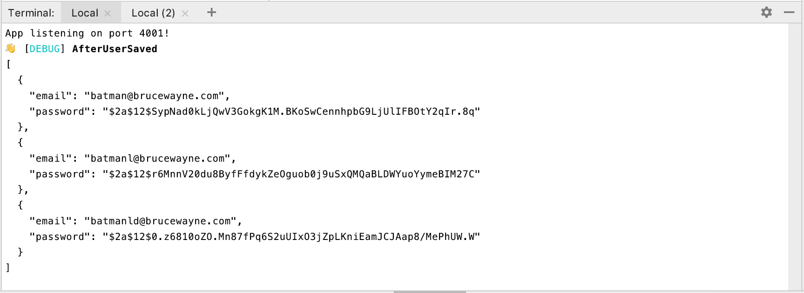

# Red handed
Debug your promises value the lazy way 🥳



## Install
```bash
npm install redhanded --save  
```
*Note, the typings are included in the package, no need to install @types/...*

## Enjoy
```typescript
import {uncover} from "redhanded"

const thing = stuffThatReturnsAPromise()
	.then(res => saveUser(res, thing))

	.then(uncover("AfterUserSaved")) // Logs the value it gets and returns it  
	
	.then(resultOfSaveUser => doOtherStuff(resultOfSaveUser)) 

```

